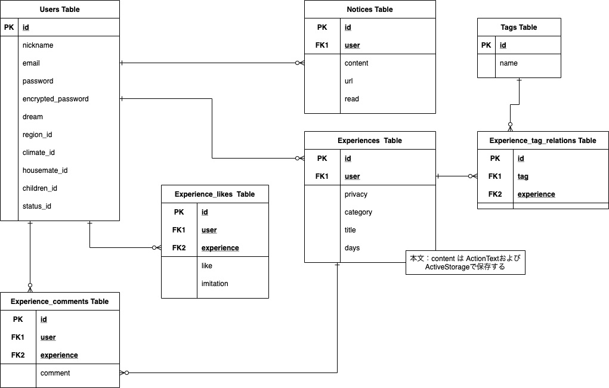

# 1. アプリケーション名
ミニマリズムシェア（Minimalism share）

# 2． アプリケーション概要
ミニマリズムに興味のある人が、自身の取り組んでいる内容を投稿したり、他者の取り組んでいる内容を検索することができるアプリケーションです。

# 3． URL
https://minimalismshare.herokuapp.com/

# 4. テスト用アカウント

## 4.1. BASIC認証

| 項目 | 内容 |
| --- | --- |
| ID | admin37052 |
| PASSWORD | techcamp37@52 |


## 4.2. ログインアカウント

| 項目 | 内容 |
| --- | --- |
| 名前 | 田中太郎 |
| メールアドレス | `test01user@test.com` |
| パスワード | `abc456` |
| 夢・目標 | プログラミング |
| 住まいの最高気温 | 40℃ |
| 住まいの最低気温 | 5℃ |
| 同居の人数 | １人 |
| 趣味の多さ | どちらかといえば無趣味／無関心事 |
| お店との距離 | 日用品や救急セットは近くのお店にある |
| 現在の状況 | ちょっとだけ減らした |

| 項目 | 内容 |
| --- | --- |
| 名前 | 高橋次郎 |
| メールアドレス | `test02user@test.com` |
| パスワード | `abc456` |
| 夢・目標 | 仕事の独立 |
| 住まいの最高気温 | 20℃ |
| 住まいの最低気温 | -10℃ |
| 同居の人数 | 家族 |
| 趣味の多さ | 多趣味／関心事の変化が多い |
| お店との距離 | どの店も遠い |
| 現在の状況 | ちょっとだけ減らした |

# 5. 利用方法
URLにアクセスしていただきページを表示してください。

ログインせずとも他の利用者から投稿された内容を閲覧することができます。

また、検索欄から投稿内容を絞り込みやソートすることができます。

投稿する場合は、画面右上の「ログイン」からログイン、または「新規作成」からアカウントを作成することができます。

「記事を書く」から新規記事を投稿することができます。

## 5.1. 操作イメージGif


# 6. 目指した課題解決

## 6.1. 背景と狙い
２０２０年頃からミニマリズムという考え方を取り入れ、生活をシンプルにしようとする人々が話題になりました。ミニマリズムを持った人のことをミニマリストと呼び、一部のミニマリストがメディアでも取り上げられています。

話題になり真似する人が増えたところまでは良かったのですが、問題も生まれました。ミニマリストで有名な人と同じ生活をしようとして、布団や服を減らした結果として病気になったり、お金を多く消費したのちミニマリズムをやめてしまう人が出てきました。
本来、ミニマリズムは注力したい対象があり、注力するために生活をシンプルにするという考え方のはずです。決して物を持ってはいけないわけではありません。極端に物を持たない人だけが有名になった結果、誤解が生まれていると思います。

そこで、もっと気軽にミニマリズムに関する情報を共有できるサイトの構築が必要だと思いました。現状、ミニマリストが発信しているメディアは、テレビ、本、ブログ、Twitterが主です。テレビ、本は主に極端に物を捨てた人が中心になっています。極端に物を捨てているわけではない人は、ブログ、Twitterです。これらは専用のページではないため多くの情報に埋もれています。ミニマリズムに関する情報を共有する専用サイトを構築することで、ミニマリズムの実現や情報の整理を助けるサイト構築を行います。

## 6.2. ペルソナ

| 項目 | 内容 |
| --- | --- |
| 年齢 | ・２０代〜４０代 |
| 性別 | ・関係なし |
| 職業 | ・関係なし |
| 家族 | ・家族がいるが、全員がミニマリズムに共感している<br>・一人暮らし |
| 特徴 | ・ミニマリズムに共感する人<br>・ミニアルバムを実現する具体的な方法を探すことに苦労している<br>・ミニマリズムの考え方について議論したい人 |
| 機器 | ・スマートフォン<br>・ノートPC |

## 6.3 ユーザーストーリー

### 6.3.1 ユーザーの課題
* どのようなミニマリズムが存在するのか情報が偏りがある
  * 有名な人は極端にものが少なく、自分に近い環境ではないことがある
  * 調べても例を挙げられるだけで、対象となっている物が限定的なことが多い
* 自分と同じレベルの人が探せない
* 現状共有ツールとしてはTwitterかブログが中心で、情報が埋もれている可能性がある
* ミニマリズムを誤解している人がいる
  * ものを捨てすぎて不便になりストレスが溜まった
  * 布団を有名な人と同じものに変えたら風邪をひいた
  * ものを捨てたが結局増えてきた
  * 食事制限に耐えられなかった
  * 趣味のものが持ちづらくなった
* 考え方について議論の余地がある

### 6.3.2 解決するための機能
 * ミニマリズムを実践した人の経験を投稿する機能
 * ミニマリズムを実践した人の経験を検索する機能
 * 自分と近い人が検索するため、対象とする物や、投稿者の家に住む人の人数、家の中にある物の数に対する傾向を調べることができる検索機能
 * 自分の傾向がわからない場合でも、ランキングから多くの人が共感したり、真似したいと思う人を調べることが可能にするランキング機能
 * Twitterでミニマリズムを報告している人が継続して報告できるようにするため、Twitter連携
 * 意見が分かれる話や、誤解を解消するための、思考の共有機能
 * 解決方法が分からない人向けの相談機能
 * 情報をいち早く知りたい人のためのウォッチ機能

# 7. 洗い出した要件

## 7.1 要件一覧
 * 共通部
   * ヘッダーメニュー
   * サイトに関しての説明ページ
 * ユーザーを認証する機能
   * ログイン（手入力版／Twitter連携）ページ
   * サインイン（手入力版／Twitter連携）ページ
   * パスワード変更ページ
 * ユーザー情報を管理する機能
   * マイページ
 * ミニマリズムの経験を投稿する機能
   * 経験を投稿するページ
   * 経験の投稿を一覧表示／検索するページ
   * 経験の投稿を閲覧／削除（コメントを投稿／編集／削除を含む）するページ
   * 経験の投稿を編集するページ
   * 経験の投稿に関するランキングページ

## 7.2 共通部 の要件
* 状態：ログイン状態に関わらない
   * ボタン
    * みんなの経験：経験の投稿を一覧表示するページへ遷移できる
    * About　　　：サイトに関しての説明ページへ遷移できる
  * 表示
    * 表示中のページが、「みんなの経験／about」のいずれかであるか判断できるように表示する
    * 全画面共通で表示する
* 状態：未ログインユーザーが画面を表示した
   * ボタン
    * ログイン：ログインページへ遷移できる
    * 新規作成：アカウント新規作成ページへ遷移できる
  * 表示
    * マイページへ遷移できない
* 状態：ログイン済ユーザーが画面を表示した
  * ボタン
    * マイページ：マイページに遷移できる
    * ログアウト：ログアウトできる
    * 記事を書く：新規投稿ページへ遷移できる（複数ある場合はプルダウンで選択する）
  * 表示
    * アカウントのニックネームを表示する
    * ログイン／アカウント新規作成ページへ遷移できない

## 7.3 ログイン（手入力版／Twitter連携）ページ の要件
* 状態：未ログインユーザーが画面を表示した
  * 入力エリア
    * メールアドレス：必須、＠マークを含む
    * パスワード　　：必須、６文字以上、半角英数字混合
  * ボタン
    * ログイン：入力エリアを入力してログインボタンを押す
    * ログイン：ログインボタンを押して、ログインに成功した場合は、「経験の投稿を一覧表示／検索するページ」へ遷移する
    * ログイン：入力内容に不備がある場合は、ページにとどまり、エラーメッセージを表示する
    * ログイン：ページにとどまった場合は、入力中のデータは消えない（パスワードを除く）
    * Twitter：Twitterアカウントでログインする
  * 表示
    * エラーメッセージは日本語で表示する
* 状態：ログイン済ユーザーが画面を表示した
  * 表示
    * ログイン済ユーザーは表示できない

## 7.4 サインイン（手入力版／Twitter連携）ページ の要件
* 状態：未ログインユーザーが画面を表示した
  * 入力エリア
    * 登録方法　　　　：必須、手入力／Twitter
    * ニックネーム　　：必須、１文字以上６文字以下
    * メールアドレス　：必須、＠マークを含む
    * パスワード　　　：必須、６文字以上、半角英数字混合
    * パスワード確認　：必須、パスワードとパスワード（確認）は、値の一致
    * 夢・目標　　　　：任意、テキストエリア
    * 住まいの最高気温：任意、「10以下、15、20、25、30、35、40、45、50以上」℃
    * 住まいの最低気温：任意、「20以上、15、10、5、0、-5、-10、-15、-20、-25以下」℃
    * 同居人数　　　　：任意、「１人／２人／家族」人暮らし
    * 趣味の多さ　　　：任意、「どちらかといえば無趣味／無関心事、１つの集中する趣味／関心事がある、多趣味／関心事の変化が多い」
    * お店との距離　　：任意、「お店どころか運送業者も来れない、どの店も遠い、日用品や救急セットは近くのお店にある、だいたいの店は近い」
    * 現在の状況　　　：任意、「すでにかなり物が少ない／ある程度物を減らして片付いている／ちょっとだけ減らした／まだ何もしてない」
  * ボタン
    * 新規作成：入力エリアに入力して新規作成ボタンを押す
    * 新規作成：新規作成ボタンを押して、アカウントの作成に成功した場合は、ログイン済みとなり、「経験の投稿を一覧表示／検索するページ」へ遷移する
    * 新規作成：入力内容に不備がある場合は、ページにとどまり、エラーメッセージを表示する
    * 新規作成：ページにとどまった場合は、入力中のデータは消えない（パスワードを除く）
  * 表示
    * エラーメッセージは日本語で表示する
* 状態：ログイン済ユーザーが画面を表示した
  * ログイン済ユーザーは表示できない

## 7.5 マイページ の要件
* 状態：未ログインユーザーが画面を表示した
  * 未ログインユーザーは表示できない
* 状態：ログイン済ユーザーが画面を表示した
  * 表示
    * サインイン時に登録した内容が表示可能とする
    * 自身の投稿内容を一覧表示できる
    * ウォッチしている記事を一覧表示できる

## 7.6 経験を投稿するページ の要件
* 状態：未ログインユーザーが画面を表示した
  * 未ログインユーザーは表示できない
* 状態：ログイン済ユーザーが画面を表示した
  * 入力エリア
    * タイトル：必須、１文字以上
    * タグ　　：任意、インクリメンタルサーチ可能、主に対象物を登録するイメージ
    * 結果　　：必須、「成功／失敗」
    * 経過　　：必須、「０日以下、最近、１ヶ月程度、３ヶ月程度、半年程度、１年、１年以上」
    * ストレス：必須、１文字以上
    * 本文　　：必須、１文字以上
  * ボタン
    * 投稿：入力エリアに入力して投稿ボタンを押す
    * 投稿：投稿に成功した場合は、「経験の投稿を一覧表示／検索するページ」へ遷移する
    * 投稿：投稿し失敗した場合は、ページにとどまり、エラーメッセージを表示する
    * 投稿：ページにとどまった場合は、入力中のデータは消えない
  * 表示
    * エラーメッセージは日本語で表示する

## 7.7 経験の投稿を一覧表示／検索するページ の要件
* 状態：ログイン状態に関わらない
  * 入力
    * 検索文字：任意
  * ボタン
    * 投稿記事　　　：投稿記事をクリックすることで詳細画面へ遷移する
    * 検索オプション：検索オプションを折りたたみメニューとして表示する
    * 検索　　　　　：入力エリアの文字列および検索オプションの内容を基に、対象の記事を絞り込みソートする
  * 表示
    * 経験の投稿に関わる記事を一覧表示する
    * 一覧は最初の２０件までを表示する
    * それ以降はページ切り替えで２０件ごとに表示する
    * １つの記事には「画像、タイトル、ユーザー（登録時の内容を参照）、いいね数、真似した数、更新日付」を表示する


## 7.8 経験の投稿を閲覧／削除（コメントを投稿／編集／削除を含む）するページ の要件
* 状態：ログイン状態に関わらない
  * 表示
    * 投稿した内容を閲覧することができる
    * コメント（本文、日時、ユーザー名）を閲覧することができる
* 状態：未ログインユーザーが画面を表示した
  * 表示
    * コメントの入力欄を表示しない
    * コメントの編集／削除ボタンを表示しない
    * 編集ボタンを表示しない
    * 削除ボタンを表示しない
* 状態：ログイン済ユーザー＆作者ではないユーザーが画面を表示した
  * 入力エリア
    * コメント：必須
  * ボタン
    * コメント投稿：入力エリアに入力された文字をコメントとして投稿する
    * コメント編集：自分のコメントを編集することができる
    * コメント削除：自分のコメントを削除することができる
    * いいね　　　：クリックすることで閲覧者が評価できる
    * 真似した　　：クリックすることで閲覧者が評価できる
  * 表示
    * 編集ボタンを表示しない
    * 削除ボタンを表示しない
* 状態：ログイン済ユーザー＆作者が画面を表示した
  * 入力エリア
    * コメント：必須
  * ボタン
    * 編集　　　　：クリックすることで「経験の投稿を編集するページ」へ遷移できる
    * 削除　　　　：クリックすることで記事を削除できる
    * コメント投稿：入力エリアに入力された文字をコメントとして投稿する
    * コメント編集：自分のコメントを編集することができる
    * コメント削除：自分と他のユーザーのコメントを削除することができる
  * 表示
    * ログイン済ユーザー＆作者であれば、編集ボタンと削除ボタンを表示する


## 7.9 経験の投稿を編集するページ の要件
* 状態：未ログインユーザー、または、ログイン済ユーザーだが作者以外のユーザーが画面を表示した
  * 画面を表示することはできない
* 状態：ログイン済ユーザー＆作者が画面を表示した
  * 最初の投稿の時と同じ内容が編集できる
  * 入力チェックの判定や表示も最初の投稿と同じ

# 8. 実装した機能についての画像やGIFおよびその説明

## 8.1. DEMO

### 8.1.1. TOP画面


### 8.1.2. アカウント作成画面


### 8.1.3. ログイン画面


### 8.1.4. マイページ画面


### 8.1.5. 記事一覧画面（検索）


### 8.1.6. 記事の新規作成画面


### 8.1.7. 記事の閲覧画面


## 8.2. 工夫したポイント

* ミニマリズムが題材なのであまり色を多く使わないようにした
* ミニマリズムは気温や家族の有無、お店が近いかによってできることが変わるのでユーザー情報を表示したり、検索が可能にした
* ミニマリズムの是非について揉めにくくすることを目指し、思想の統一を図るため、ユーザー登録時に夢・目標を入力するようにした
* タグを入力することにより、利用者が自由度を設けた
* リッチテキスト(ActionText)を導入することで記事の記述内容に自由度を設けた

# 9. 使用技術(開発環境)

## 9.1. バックエンド
Ruby on Rails6, Ruby, ImageMagick

### 9.1.1. Rails Gem
devise, active_hash, rails-i18n, ransack, kaminari, rubocop, image_processing, mini_magick

## 9.2. フロントエンド
HTML, SCSS, Kube CSS Frame work, Font Awesome

## 9.3. データベース
MySQL

## 9.4. テスト
RSpec, Faker, Factory bot, Capybara

## 9.5. デプロイ
heroku

## 9.6. ソースコード管理
GitHub

## 9.7. IDE
Visual Studio Code


# 10. 実装予定の機能

# 10.1. 修正見直し
* 入力制限の見直し
  * ニックネーム
    * 現状は6文字だが、Twitter連動の場合にTwitterのアカウント名が使えない
    * Twitterアカウント名と同じ文字数や文字種を登録可能にし表示できるようにする
  * 記事のタイトル、ストレス、タグ１つ
    * 現状は文字数制限がないため、画面を飛び出ることが考えられる
  * パスワードの使用可能文字見直し
    * 現状はパスワードとして記号が使えないため使用可能にする
  * タグ数の見直し
    * タグの数に制限が無いため、制限を設ける(10件)
* テーブル構造見直し
  * 評価機能
    * いいねのカラムと真似したカラムがあるが、これにより各記事の情報を取得する際に必ず2回SQLを実行しているので、回数を減らすために、テーブル定義を見直す
    * カテゴリカラムを追加して、データとして「いいね」「真似した」を持つことでgroup byとcountを使用することで1回で取得可能にしたい
  * ソート
    * ソート対象のカラムはインデックスを追加する
* 可読性等の見直し
  * FormObject
    * 記事の内容とタグを同時に保存するのでFormObjectを使用したが、Railsの恩恵が少なく感じる＆可読性が低くなっているとおもうので見直す
    * FormObjectをやめる場合は、タグを記事保存前にJavaScriptでチェックしてエラーがない場合に、記事の保存ボタンが押せるようにする
    * FormObjectをやめない場合は、Serviceやconcernsを作成して可読性を改善を検討する
  * set_like_find_paramsメソッド
    * set_like_find_paramsが各コントローラーにあり、その戻り値が必要なメソッドはApplicationControllerのset_experience_likeになっているため、可読性が良くないと思うので統一する
    * concernsを作成して改善を検討する
  * 各メソッド名
    * 動詞＋形容詞になっているか確認する
* 通知文の見直し
  * コメントが長いと通知欄にも、その全文がでるので画面を下に貫通する可能性がある
* タグ入力方法の見直し
  * タグの入力方法がインクリメンタルサーチにしたが、全角であるため恩恵が少ないかもしれない、別の方法も再検討する
  * タイトルや本文からおすすめのタグを表示する（機能追加扱いにする可能性あり）
  * 入力した文字の全角半角を統一したい（機能追加扱いにする可能性あり）
* ユーザー情報のタブ表示を見直し
  * Kube CSS Frameworkのタブを使って実装したが、ユーザーのいいねした記事一覧などでページ切り替えをすると、タブの１つ目が必ず表示されてしまい使いにくくなったので、ページ切り替えができるようにタブ別に別の画面を呼び出すようにする

# 10.2. 機能追加
* ユーザー情報の変更機能
  * 引っ越しが発生した場合でも使い続けることができるように編集可能にする
  * 記事の投稿時にユーザー情報を保存する
  * 記事編集の選択肢として記事に紐付いたユーザー情報を編集可能にする
* ソート機能の強化
  * いいねや真似した数でソートを可能にする
  * 作成日時でもソート可能にする
* 思考の共有ページ
  * Wikiのような使い方ができる
  * ノウハウや思想の違いをまとめる
* 相談ページ
  * 自分の状況を説明してアドバイスをもらう
  * 使用予定技術：Action Cable
* 本推奨機能
  * 本の避難ではなく、本を推奨ポイントを探してコメントする
  * Amazonなどの通販サイトをリンクする
  * Amazonアソシエイトの検討
* ランキング機能
  * いいねランキング、真似したランキング
  * 使用予定技術：Active Job、Delayed Job
* ウォッチ機能
  * ウォッチ対象にしたユーザーやタグの記事に追加があった場合にお知らせを更新する
  * メール機能による通知も行う
* メール機能
  * アカウントの作成、パスワード変更通知メール
  * 自身の投稿した記事に評価機能（いいね、真似した）の更新通知メール
  * ランキングの定期送信メール
  * 問い合わせページおよび問い合わせメール送信
  * 使用予定技術：Action Mailer
* パスワードリセット
  * パスワードを忘れた人向け機能
* Twitter連動
  * ログイン連動：Twitterアカウントでアカウント作成およびログインを可能にする
  * 投稿連携：記事を投稿したことをTwitterで通知する
  * 使用予定技術：omniauth-twitter
* フロント／サーバーの分離、および、スマホアプリ（ネイティブ）の製作
  * スマホからでも投稿や閲覧が可能になるようにする
  * 今後もアプリケーション規模が大きくなることを想定してフロント／サーバーの分離
  * 使用予定技術：Angular、Swift
* heroku画像保存対応
  * AWS S3対応
  * またはすべてAWSにするかも含めて検討


# 11. データベース設計

## 11.1. ER図



## 11.2. users テーブル

| Column              | Type    | Options                   |
| ------------------- | ------- | ------------------------- |
| email               | string  | null: false, unique: true |
| encrypted_password  | string  | null: false               |
| nickname            | string  | null: false               |
| dream               | string  | null: false               |
| high_id             | integer | null: false               |
| low_id              | integer | null: false               |
| housemate_id        | integer | null: false               |
| hobby_id            | integer | null: false               |
| clean_status_id     | integer | null: false               |
| range_with_store_id | integer | null: false               |

### 11.2.1. Association(Active Hash)
- belongs_to :high
- belongs_to :low
- belongs_to :housemate
- belongs_to :hobby
- belongs_to :clean_status
- belongs_to :range_with_store

### 11.2.2. Association(Active Record)
- has_many :experiences
- has_many :experience_likes
- has_many :experience_comments
- has_many :notices


## 11.3. experiences テーブル

| Column      | Type       | Options                         |
| ----------- | ---------- | ------------------------------- |
| title       | string     | null: false                     |
| category_id | integer    | null: false                     |
| days_id     | integer    | null: false                     |
| stress      | string     | null: false                     |
| user        | references | null: false, foreign_key: true  |

本文はActionTextおよびActiveStorageに保存する

### 11.3.1. Association(Active Hash)
- belongs_to :period
- belongs_to :category
  
### 11.3.2. Association(Active Record)
- belongs_to :user
- has_many :experience_tag_relations, dependent: :destroy
- has_many :tags, through: :experience_tag_relations
- has_many :experience_comments, -> { order(updated_at: :desc) }, dependent: :destroy
- has_many :experience_likes, dependent: :destroy
- has_rich_text :content
- has_one :content, class_name: 'ActionText::RichText', as: :record, dependent: :destroy


## 11.4. experience_comments テーブル

| Column     | Type       | Options                         |
| ---------- | ---------- | ------------------------------- |
| comment    | text       | null: false                     |
| user       | references | null: false, foreign_key: true  |
| experience | references | null: false, foreign_key: true  |

### 11.4.1. Association(Active Record)

- belongs_to :user
- belongs_to :experience


## 11.5. experience_likes テーブル
| Column     | Type       | Options                         |
| ---------- | ---------- | ------------------------------- |
| like       | boolean    | null: false                     |
| imitate    | boolean    | null: false                     |
| user       | references | null: false, foreign_key: true  |
| experience | references | null: false, foreign_key: true  |


### 11.5.1. Association(Active Record)

- belongs_to :user
- belongs_to :experience


## 11.6. experience_tag_relations テーブル
| Column     | Type       | Options                         |
| ---------- | ---------- | ------------------------------- |
| tag        | references | null: false, foreign_key: true  |
| experience | references | null: false, foreign_key: true  |

### 11.6.1. Association(Active Record)

- belongs_to :tag
- belongs_to :experience


## 11.7. notices テーブル
| Column     | Type       | Options                         |
| ---------- | ---------- | ------------------------------- |
| message    | string     | null: false                     |
| url        | string     |                                 |
| read       | boolean    | null: false                     |
| user       | references | null: false, foreign_key: true  |

### 11.7.1. Association(Active Record)

- belongs_to :user


## 11.8. tags テーブル
| Column | Type    | Options                   |
| ------ | ------- | ------------------------- |
| name   | string  | null: false, unique: true |


### 11.8.1. Association(Active Record)

- has_many :experience_tag_relations
- has_many :experiences, through: :experience_tag_relations


# 12. ローカルでの動作方法

環境情報
```
user@pc minimalismshare % rails about
About your application's environment
Rails version             6.0.4.1
Ruby version              ruby 2.6.5p114 (2019-10-01 revision 67812) [x86_64-darwin20]
RubyGems version          3.0.3
Rack version              2.2.3
Middleware                Webpacker::DevServerProxy, ActionDispatch::HostAuthorization, Rack::Sendfile, ActionDispatch::Static, ActionDispatch::Executor, ActiveSupport::Cache::Strategy::LocalCache::Middleware, Rack::Runtime, Rack::MethodOverride, ActionDispatch::RequestId, ActionDispatch::RemoteIp, Sprockets::Rails::QuietAssets, Rails::Rack::Logger, ActionDispatch::ShowExceptions, WebConsole::Middleware, ActionDispatch::DebugExceptions, ActionDispatch::ActionableExceptions, ActionDispatch::Reloader, ActionDispatch::Callbacks, ActiveRecord::Migration::CheckPending, ActionDispatch::Cookies, ActionDispatch::Session::CookieStore, ActionDispatch::Flash, ActionDispatch::ContentSecurityPolicy::Middleware, Rack::Head, Rack::ConditionalGet, Rack::ETag, Rack::TempfileReaper, Warden::Manager
Application root          /Users/username/projects/minimalismshare
Environment               development
Database adapter          mysql2
Database schema version   20211109080537
```

データベース情報
```
user@pc minimalismshare % mysql --version
mysql  Ver 14.14 Distrib 5.6.51, for osx10.16 (x86_64) using  EditLine wrapper
```


導入手順
```
user@pc project % git clone https://github.com/ryohei-takasugi/minimalismshare.git
user@pc project % cd minimalismshare
user@pc minimalismshare % bundle install
user@pc minimalismshare % rails db:create
user@pc minimalismshare % rails db:migrate
user@pc minimalismshare % rails s
```

環境変数の設定
```
user@pc minimalismshare % cat ~/.zshrc 
eval "$(rbenv init -)"
export PATH="/usr/local/opt/mysql@5.6/bin:$PATH"
export PATH="/usr/local/opt/node@14/bin:$PATH"
export BASIC_AUTH_USER='admin37052'
export BASIC_AUTH_PASSWORD='techcamp37@52'
```
